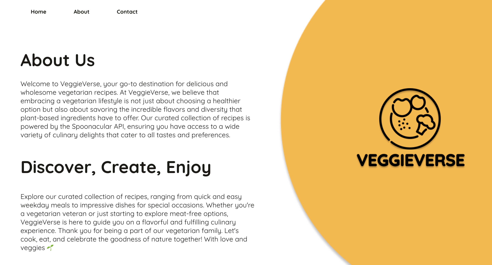

# **VeggieVerse**

🔗 [https://veggieverse.netlify.app]

## **Description:**

VeggieVerse is a web platform dedicated to providing a rich array of vegetarian recipes, offering a delightful culinary experience for vegetarians. With a seamless integration of the Spoonacular API, users can explore, discover, and create meat-free dishes effortlessly.

## **Features**

1. **SearchPage:** This feature allows users to search for vegetarian recipes based on their preferences. Users can enter keywords and instantly access a curated list of recipes.

1. **RecipePage:** Users can view detailed information about individual recipes, including ingredients, instructions, and images, providing a comprehensive cooking guide.

1. **ContactPage:** A user-friendly contact form enables users to reach out to the VeggieVerse team effortlessly for inquiries, feedback, or assistance.

1. **AboutPage:** Learn more about VeggieVerse, its mission, and the team behind it. Discover the ethos of embracing a vegetarian lifestyle and the diverse range of recipes available on the platform.

## **Technologies Used**

- **React:** VeggieVerse is built using React, a popular JavaScript library for building user interfaces. React's component-based architecture allows for efficient development and maintenance of complex web applications.

- **React Router:** React Router is utilized for navigation within VeggieVerse, enabling seamless routing between different pages of the application.

- **Axios:** Axios is used for making HTTP requests to the Spoonacular API to fetch recipe data. It provides a simple and efficient way to handle asynchronous operations.

- **Spoonacular API:** VeggieVerse integrates with the Spoonacular API to fetch vegetarian recipe data. The Spoonacular API provides extensive recipe information, including ingredients, instructions, and images.

- **EmailJS:** EmailJS is used in the ContactPage feature to send messages via email. It simplifies the process of integrating email functionality into web applications.

- **HTML/CSS:** VeggieVerse's user interface is styled using HTML and CSS. CSS is used to customize the appearance of components and ensure a visually appealing user experience.

## Screenshots

